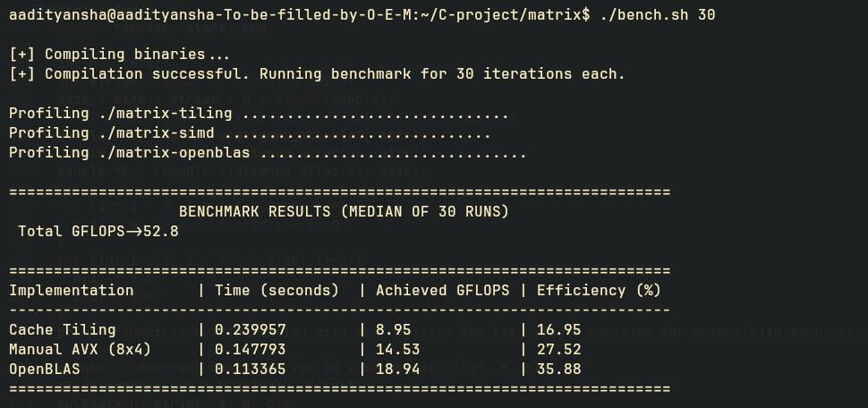

# Matrix Multiplication: An execution analysis

A bottom-up exploration of high-performance computing in C.

This project documents the optimization journey of a Double-Precision General Matrix Multiplication (DGEMM) kernel — starting from naive triple loops, progressing through L1 cache tiling and manual AVX-256 register blocking (8×4), and finally benchmarking against the industry-standard OpenBLAS implementation.

The goal was not to outperform OpenBLAS or achieve theoretical peak GFLOPS, but to analyze how execution behavior changes under different optimization techniques, algorithmic choices, and hardware constraints.

---

## Benchmark Results

The benchmark below compares execution time, achieved GFLOPS, and percentage of theoretical peak throughput for a 1024×1024 matrix multiplication workload.

Median of 30 runs.

---

## Hardware Specifications

All benchmarks were executed on bare-metal hardware.

* **CPU:** Intel® Core™ i3-2120 @ 3.30 GHz (Sandy Bridge / 2nd Gen)
* **Topology:** 2 Physical Cores / 4 Threads
* **Instruction Set:** AVX (256-bit registers)
* **Limitations:** No AVX2 and no FMA (Fused Multiply-Add), requiring separate multiply and add instructions
* **L1 Data Cache:** 64 KiB total (32 KiB per core)
* **Peak Theoretical Compute:** ~52.8 GFLOPS (Double Precision)

---

## Optimization Timeline

### 1. Naive Matrix Multiplication

Baseline implementation using standard triple nested loops.

### 2. Cache Tiling / Blocking

Partitioned matrices into cache-friendly tiles with padding to improve locality,reduce memory stalls and eliminate cache set collision.

### 3. Manual AVX Register Blocking (8×4)

Used AVX-256 intrinsics to process multiple double-precision values in parallel and reduce scalar instruction overhead.

### 4. Benchmark Against OpenBLAS

Compared the handwritten implementation against a production-grade BLAS library.

---

## References

MIT Performance Engineering:
https://ocw.mit.edu/courses/6-172-performance-engineering-of-software-systems-fall-2018/video_galleries/lecture-videos/

Agner Fog — Optimizing Software in C++:
https://www.agner.org/optimize/optimizing_cpp.pdf

Matrix Multiplication Optimization Notes:
https://michalpitr.substack.com/p/optimizing-matrix-multiplication

---

If you're interested, I can also publish a detailed write-up covering the exact optimization path, benchmark methodology, cache effects, and AVX implementation decisions.

Feel free to explore, modify, benchmark, or improve it.

Keep learning :>
